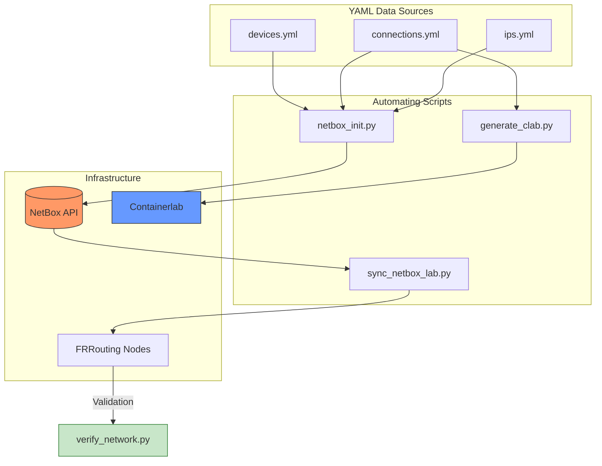
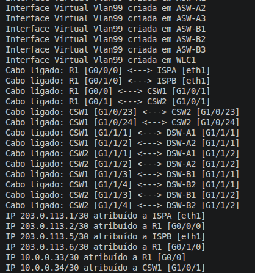
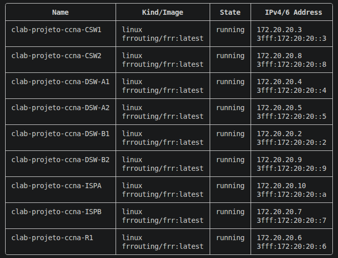
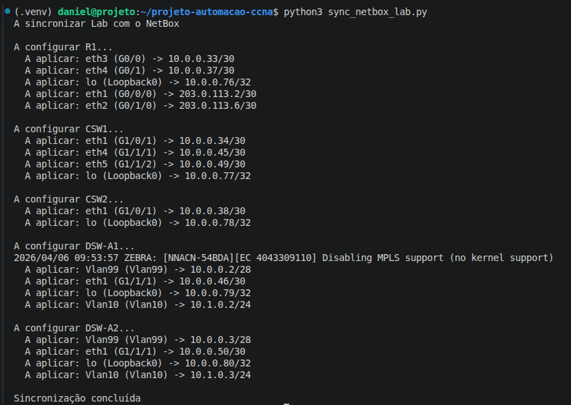
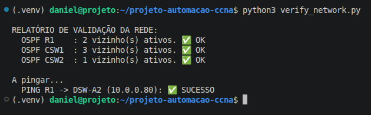

# Network Automation Framework: NetBox + Containerlab + FRR

This project demonstrates the implementation of an Infrastructure as Code (IaC) methodology for network infrastructure automation. It utilizes NetBox as the Single Source of Truth (SSoT) to manage the full lifecycle of a simulated virtualized network, from inventory management to connectivity validation.

## Overview
The solution addresses configuration inconsistency issues through the automation of four key pillars:
1. Dynamic Inventory: Automatic synchronization of YAML data with the NetBox API.
2. Topology Orchestration: Programmatic generation of lab scenarios based on connectivity graphs.
3. Idempotent Provisioning: Automated configuration of interfaces, VLANs, and routing protocols (OSPF) via Python.
4. Continuous Verification: Automated testing to ensure the network reaches its intended state.

---

## Workflow (Automation Pipeline)

The diagram below illustrates the interaction between tools and the data flow within the ecosystem:

🛠️ Technology Stack
NetBox
Containerlab
FRRouting
Python 3.x
Docker

📂 Project Structure

    - netbox_init.py: Initializes NetBox with sites, roles, device models, and IP addresses.

    - generate_clab.py: Programmatically generates the projeto.clab.yml topology file.

    - sync_netbox_lab.py: Synchronizes IP and OSPF configurations across active network nodes.

    - verify_network.py: Validation script for OSPF neighbor adjacency and E2E ICMP tests.

    - *.yml: Network definition files (Inventory, Connections, Prefixes).

🚀 How to run
1. Prerequisites

    Docker and Containerlab installed.

    A reachable Netbox instance via API.

    Python environment configured:
    Bash

    pip install -r requirements.txt

2. Step-by-step execution

    Populate NetBox:
    Bash

    python3 netbox_init.py

    Deploy:
    Bash

    sudo clab deploy -t projeto.clab.yml

    Network configuration:
    Bash

    python3 sync_netbox_lab.py

    Connectivity validation:
    Bash

    python3 verify_network.py

## 📸 Project Demo

| Step | Description | Screenshot |
| :--- | :--- | :--- |
| **1. Inventory** | Populating Netbox via API |  |
| **2. Lab** | Containerlab Deploy OK |  |
| **3. Automation** | IPs and OSPF Synchronization |  |
| **4. Validation** | Conectivity tests ✅ |  |

💡 Key Features

    Intelligent Mapping: Automatic translation of Cisco-style interface names (e.g., GigabitEthernet) to native Linux names (ethX).

    Dynamic OSPF: Automated activation of OSPF areas based on interface roles and dynamic Router-IDs.

    Error Isolation: Management of PID files and FRR process locks to ensure operational stability.

    Flexibility: Scalable topology through code-agnostic configuration files.

🚀 Roadmap & Future Implementations

This project is modular by design, allowing expansion into a complete NetDevOps ecosystem:
Phase 1: Observability & Monitoring (TIG Stack)

    Telegraf: Implement agents for metric collection via SNMP and gNMI.

    InfluxDB: Store telemetry in a Time Series Database.

    Grafana: Create dynamic dashboards for real-time visualization of traffic, OSPF adjacency states, and node health.

Phase 2: Configuration Management with Ansible

    Replace direct command injection with Ansible Playbooks.

    Use NetBox as a Dynamic Inventory for automated device discovery.

    Implement Jinja2 templates to enforce strict institutional configuration standards.

Fase 3: Pipeline de CI/CD (GitHub Actions)

    Workflow Automation: Any change in YAML files or code triggers an automatic lab redeploy.

    Continuous Testing: Integrate the validation script into the pipeline; code is only "approved" if all connectivity tests pass.

👤 Author

Daniel Veloso * LinkedIn: daniel-veloso-it

    Contact: 912678262
