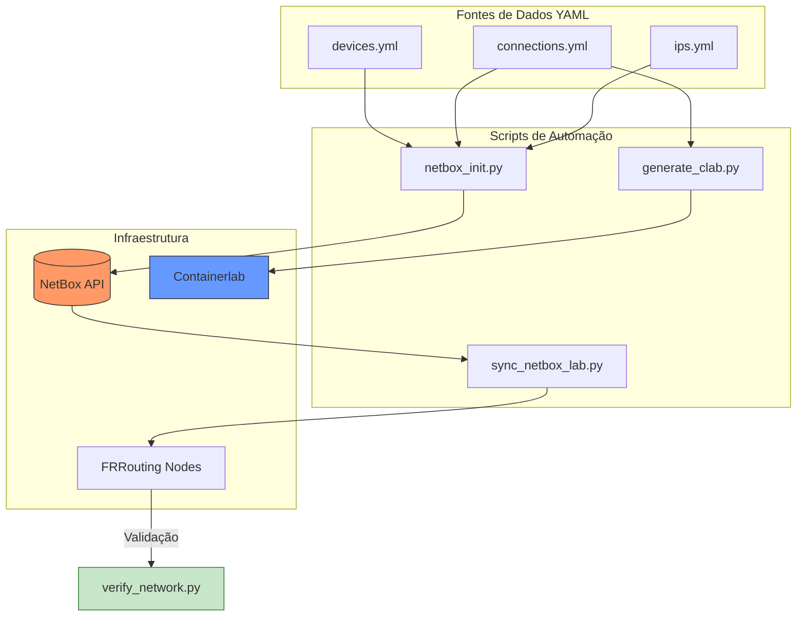

# Network Automation Framework: NetBox + Containerlab + FRR

Este projeto demonstra a implementação de uma metodologia **Infrastructure as Code (IaC)** para a automação de infraestruturas de rede. Utiliza o **NetBox** como a *Single Source of Truth* para gerir o ciclo de vida completo de uma rede virtualizada simulada, desde o inventário até à validação de conectividade.

## Visão Geral
A solução resolve o problema de inconsistência de configurações através da automação de quatro pilares:
1.  **Inventário Dinâmico:** Sincronização automática de dados YAML com a API do NetBox.
2.  **Orquestração de Topologia:** Geração programática de cenários de laboratório baseados em grafos de conectividade.
3.  **Provisionamento Idempotente:** Configuração de interfaces, VLANs e protocolos de routing (OSPF) via Python.
4.  **Continuous Verification:** Testes automatizados para garantir o estado pretendido da rede.

---

## Fluxo de Trabalho (Pipeline de Automação)

O diagrama abaixo ilustra a interação entre as ferramentas e o fluxo de dados no ecossistema:

🛠️ Stack Tecnológica
NetBox
Containerlab
FRRouting
Python 3.x
Docker

📂 Estrutura do Projeto

    - netbox_init.py: Inicializa o NetBox com sites, roles, modelos e IPs.

    - generate_clab.py: Gera o ficheiro de topologia projeto.clab.yml.

    - sync_netbox_lab.py: Sincroniza as configurações de IP e OSPF nos equipamentos ativos.

    - verify_network.py: Script de validação de vizinhança OSPF e testes de ICMP.

    - *.yml: Ficheiros de definição de rede (Inventário, Conexões, Prefixos).

🚀 Como Executar
1. Pré-requisitos

    Docker e Containerlab instalados.

    Instância do NetBox acessível via API.

    Ambiente Python configurado:
    Bash

    pip install -r requirements.txt

2. Passo a Passo

    Popular o NetBox:
    Bash

    python3 netbox_init.py

    Levantar o Laboratório:
    Bash

    sudo clab deploy -t projeto.clab.yml

    Configurar a Rede:
    Bash

    python3 sync_netbox_lab.py

    Validar Conectividade:
    Bash

    python3 verify_network.py

💡 Key Features Implementadas

    Mapeamento Inteligente: Tradução automática de interfaces Cisco para nomes nativos do Linux (ethX).

    OSPF Dinâmico: Ativação automática de áreas OSPF baseada na função de cada interface e Router-ID dinâmico.

    Isolamento de Erros: Gestão de ficheiros PID e locks de processos FRR para garantir estabilidade operacional.

    Flexibilidade: Topologia escalável através de ficheiros de configuração agnósticos ao código.

🚀 Roadmap & Futuras Implementações

O projeto foi desenhado para ser modular, permitindo a expansão para um ecossistema completo de NetDevOps. As próximas fases de desenvolvimento incluem:
Fase 1: Observabilidade & Monitorização (TIG Stack)

    Telegraf: Implementação de agentes para recolha de métricas via SNMP e gNMI.

    InfluxDB: Armazenamento de telemetria em base de dados de séries temporais.

    Grafana: Criação de dashboards dinâmicos para visualização de tráfego, estado de adjacências OSPF e saúde dos nós em tempo real.

Fase 2: Gestão de Configuração com Ansible

    Substituição da injeção de comandos por Ansible Playbooks.

    Utilização do NetBox como Dynamic Inventory, permitindo que o Ansible saiba automaticamente quais dispositivos configurar.

    Uso de templates Jinja2 para garantir que as configurações seguem um padrão institucional rígido.

Fase 3: Pipeline de CI/CD (GitHub Actions)

    Automação do fluxo de trabalho: qualquer alteração nos ficheiros YAML ou no código dispara um deploy automático no laboratório.

    Continuous Testing: Integração do script de validação na pipeline; o código só é considerado "aprovado" se todos os testes de conectividade passarem.

👤 Autor

Daniel Veloso * LinkedIn: daniel-veloso-it

    Contacto: 912678262